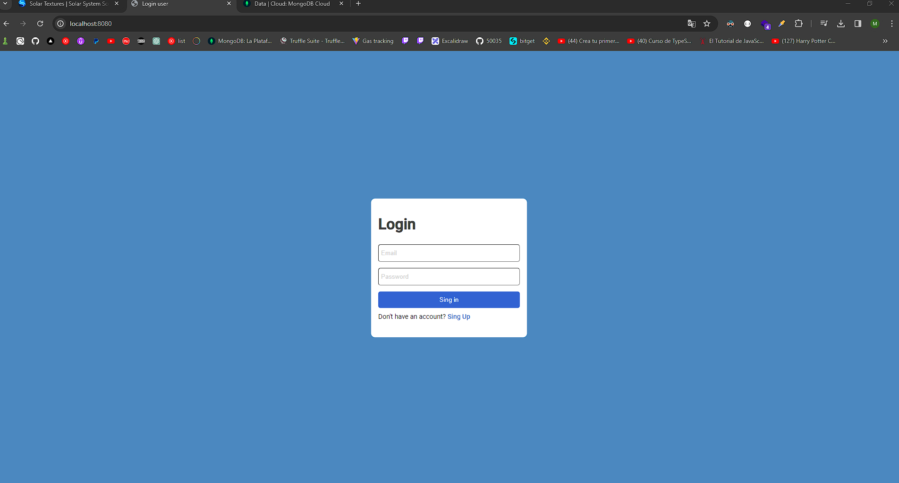
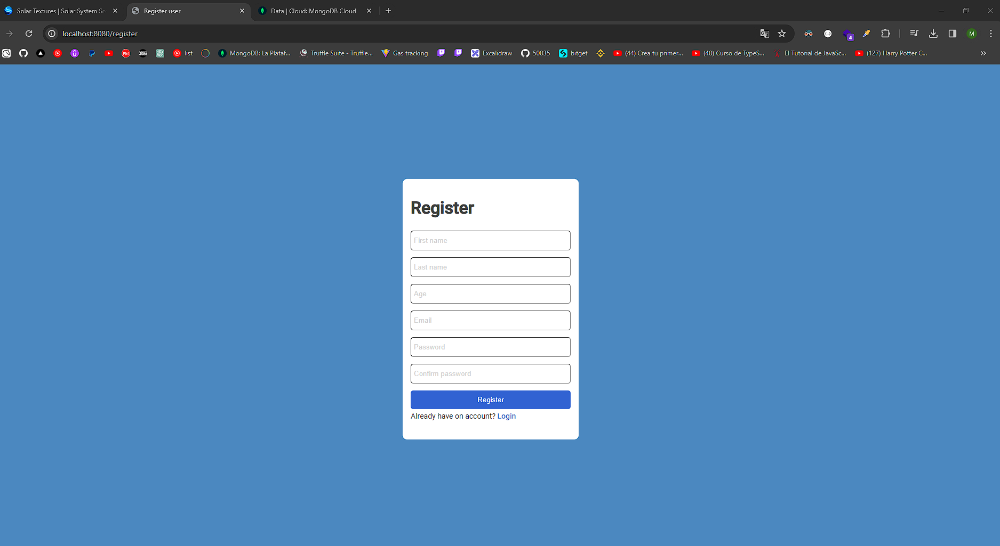
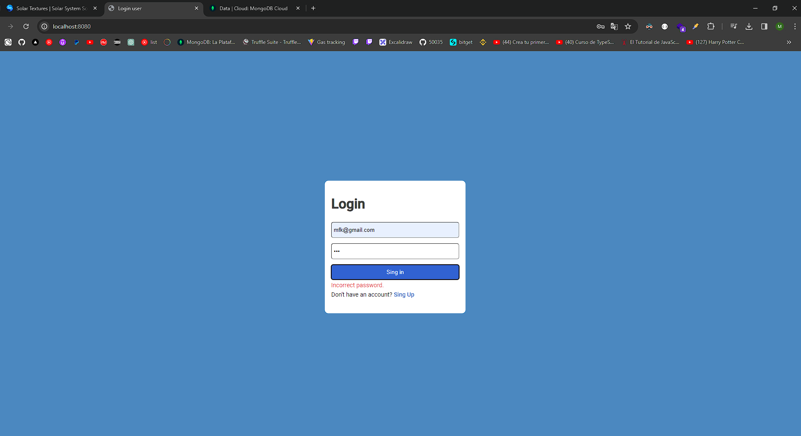
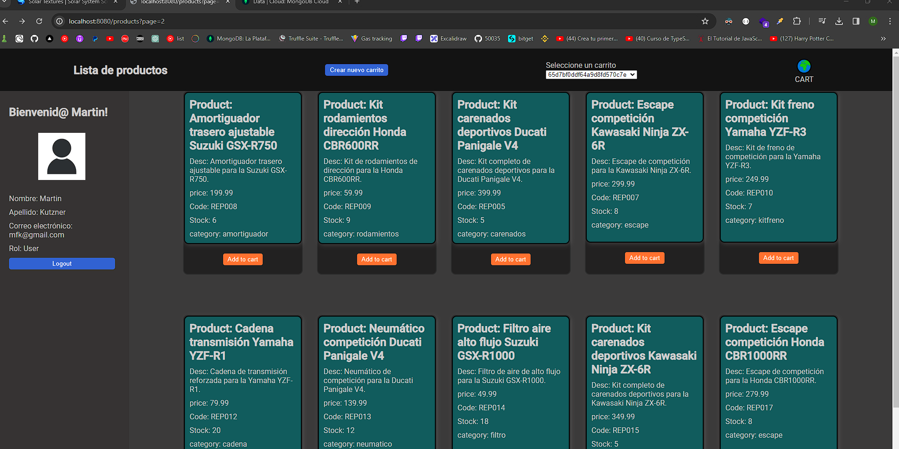
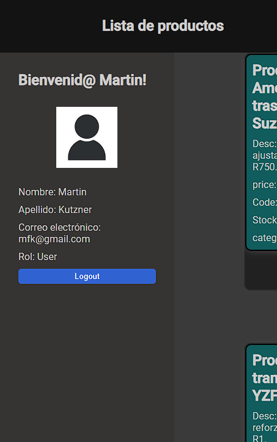
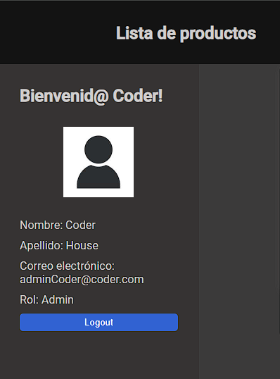
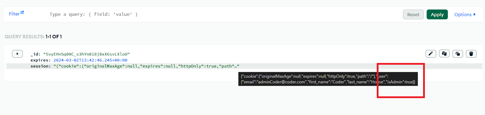
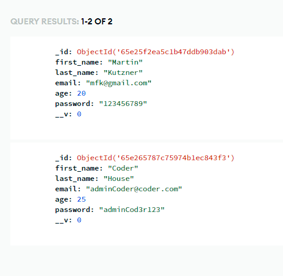

Testing

-Al cargar el proyecto, éste deberá comenzar en la pantalla de login ✅

http://localhost:8080/

-Al no tener un usuario, primero se creará un usuario, para esto, la pantalla de login deberá tener un link de redirección “Regístrate” ✅

http://localhost:8080/register

-El proceso de registro deberá guardar en la base de datos al usuario ✅

-Se regresará al proceso de login y se colocarán las credenciales de manera incorrecta, esto para probar que no se pueda avanzar a la siguiente pantalla. ✅

-Posteriormente, se colocarán las credenciales de manera correcta, esto para corroborar que se cree una sesión correctamente y que se haga una redirección a la vista de productos.✅

-La vista de productos tendrá en una parte de arriba de la página el mensaje “Bienvenido” seguido de los datos del usuario que se haya logueado (NO mostrar password). Es importante que se visualice el “rol” para ver que aparezca “usuario” o “user”✅

-Se presionará el botón de logout y se destruirá la sesión, notando cómo nos redirige a login.✅

-Se ingresarán las credenciales específicas de admin indicadas en las diapositivas, el login debe redirigir correctamente y mostrar en los datos del rol: “admin” haciendo referencia a la correcta gestión de roles.✅

adminCoder@coder.com
adminCod3r123

-Se revisará que el admin NO viva en base de datos, sino que sea una validación que se haga de manera interna en el código.✅

